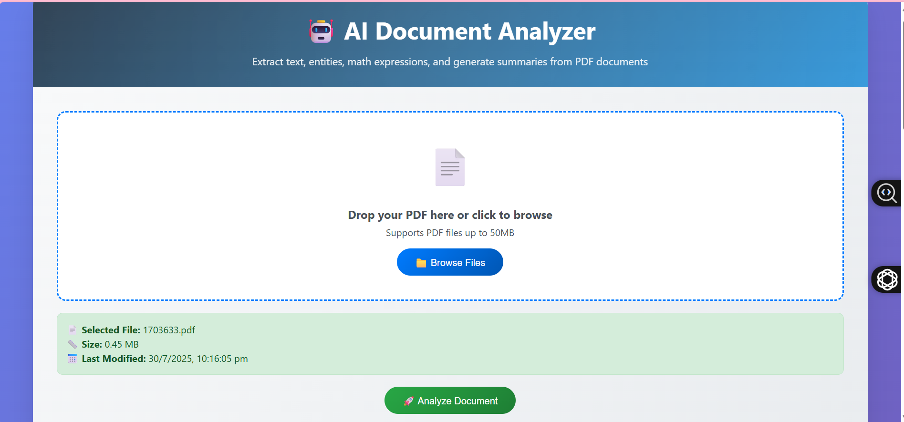
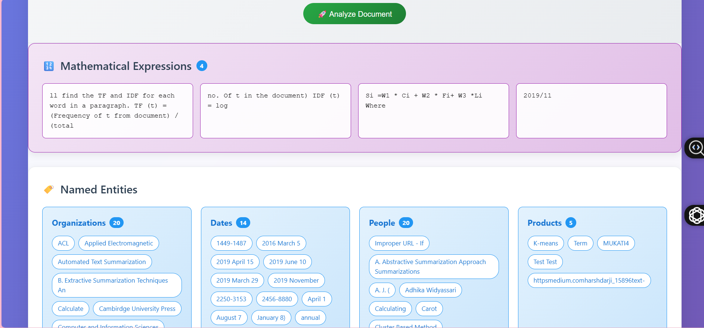
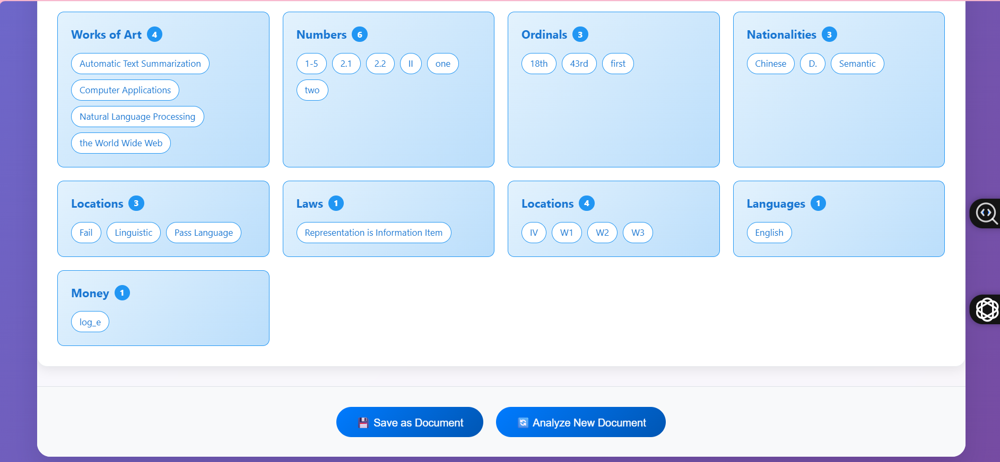

# 🤖 Smart Document Analyser

> **AI Docs Analyser is an intelligent document processing tool that extracts, classifies, and understands content from PDFs, images, and text files using OCR and NLP. It automates data extraction and tagging, enabling smarter workflows for legal, financial, and business document analysis.**

[](https://python.org)
[](https://fastapi.tiangolo.com)
[](LICENSE)
[](Dockerfile)

## 🌟 Features

- **📄 PDF Text Extraction**: Extract clean text content from PDF documents
- **🏷️ Named Entity Recognition (NER)**: Identify and categorize entities like people, organizations, dates, locations
- **🔢 Mathematical Expression Detection**: Extract and highlight mathematical formulas and expressions
- **📋 AI-Powered Summarization**: Generate intelligent summaries of document content
- **🎨 Interactive Web Interface**: Beautiful, responsive UI with drag-and-drop file upload
- **💾 Export Results**: Save analysis results as formatted text documents
- **⚡ Fast Processing**: Optimized for quick document analysis
- **🐳 Docker Support**: Easy deployment with containerization

## 🎮 Live Demo

🌐 **[Try it live here!](http://115.241.186.203:9090/)**

## 📸 Screenshots

### Main Interface

*Clean, intuitive interface with drag-and-drop PDF upload*

### Analysis Results

*Comprehensive analysis showing extracted text, entities, and mathematical expressions*

### Named Entity Recognition

*Categorized named entities with color-coded highlighting*

## 🚀 Quick Start

### Prerequisites

- Python 3.10 or higher
- pip package manager
- Git

### Local Installation

1. **Clone the repository**
   ```bash
   git clone https://github.com/your-username/smart-document-analyser.git
   cd smart-document-analyser
   ```

2. **Create virtual environment**
   ```bash
   python -m venv venv
   
   # On Windows
   venv\Scripts\activate
   
   # On macOS/Linux
   source venv/bin/activate
   ```

3. **Install dependencies**
   ```bash
   pip install -r requirements.txt
   ```

4. **Run the application**
   ```bash
   python main.py
   ```

5. **Open your browser**
   Navigate to `http://localhost:8000`

### 🐳 Docker Installation

1. **Build the Docker image**
   ```bash
   docker build -t smart-document-analyser .
   ```

2. **Run the container**
   ```bash
   docker run -d -p 8000:8000 --name smart-analyser smart-document-analyser
   ```

3. **Access the application**
   Open `http://localhost:8000` in your browser

## 📁 Project Structure

```
smart-document-analyser/
├── main.py                 # FastAPI application entry point
├── requirements.txt        # Python dependencies
├── Dockerfile             # Docker configuration
├── README.md              # Project documentation
├── templates/
│   └── index.html         # Frontend interface
├── modules/
│   ├── __init__.py
│   ├── pdf_processor.py   # PDF text extraction
│   ├── math_extractor.py  # Mathematical expression detection
│   ├── ner_processor.py   # Named Entity Recognition
│   └── summarizer.py      # Text summarization
└── screenshots/           # Demo screenshots
```

## 🔧 API Documentation

### Endpoints

#### **POST /analyze**
Complete document analysis with all features
- **Input**: PDF file (multipart/form-data)
- **Output**: JSON with text, entities, math expressions, and summary

#### **POST /extract-text**
Extract only text content
- **Input**: PDF file
- **Output**: JSON with extracted text and metadata

#### **POST /extract-entities**
Extract only named entities
- **Input**: PDF file
- **Output**: JSON with categorized entities

#### **POST /extract-math**
Extract only mathematical expressions
- **Input**: PDF file
- **Output**: JSON with mathematical expressions

#### **POST /extract-summary**
Generate only document summary
- **Input**: PDF file
- **Output**: JSON with generated summary

#### **GET /health**
Health check endpoint
- **Output**: Service status and component availability

### Example API Usage

```python
import requests

# Complete analysis
with open('document.pdf', 'rb') as f:
    response = requests.post(
        'http://localhost:8000/analyze',
        files={'file': f}
    )
    result = response.json()
    print(result['summary'])
```

## ⚙️ Configuration

### Environment Variables

```bash
# Application settings
HOST=0.0.0.0
PORT=8000
DEBUG=False
MAX_FILE_SIZE=52428800  # 50MB
```

### Resource Requirements

- **Minimum RAM**: 2GB
- **Recommended RAM**: 4GB+
- **CPU**: 2+ cores recommended
- **Disk Space**: 1GB+ for models

## 🔍 Supported Features

### File Types
- ✅ PDF documents
- ✅ Text-based PDFs
- ✅ Scanned PDFs (with OCR)
- ❌ Protected/encrypted PDFs

### Named Entity Types
- **PERSON**: People's names
- **ORG**: Organizations, companies
- **GPE**: Geopolitical entities (countries, cities)
- **DATE**: Dates and time expressions
- **MONEY**: Monetary values
- **PERCENT**: Percentages
- **PRODUCT**: Products and services
- **EVENT**: Named events
- **WORK_OF_ART**: Titles of works
- **LAW**: Legal documents
- **LANGUAGE**: Languages

### Mathematical Expressions
- Equations and formulas
- Statistical expressions
- Mathematical notation
- Variables and constants

## 🚀 Deployment

### Production Deployment with Docker

1. **Build production image**
   ```bash
   docker build -t smart-document-analyser:latest .
   ```

2. **Run container in production**
   ```bash
   docker run -d \
     -p 8000:8000 \
     --name smart-analyser \
     --restart unless-stopped \
     smart-document-analyser:latest
   ```

### Nginx Configuration

If you're using Nginx as a reverse proxy on Ubuntu:

```nginx
server {
    listen 80;
    server_name your-domain.com;
    
    location / {
        proxy_pass http://127.0.0.1:8000;
        proxy_set_header Host $host;
        proxy_set_header X-Real-IP $remote_addr;
        proxy_set_header X-Forwarded-For $proxy_add_x_forwarded_for;
        proxy_set_header X-Forwarded-Proto $scheme;
        proxy_read_timeout 300;
        proxy_connect_timeout 300;
        proxy_send_timeout 300;
    }
}
```

Then restart Nginx:
```bash
sudo nginx -t
sudo systemctl reload nginx
```

## 🧪 Testing

### Manual Testing
1. Upload a sample PDF through the web interface
2. Verify all components are working at `/health` endpoint
3. Test API endpoints with curl or Postman

## 🐛 Troubleshooting

### Common Issues

1. **"PDF extraction service not available"**
   - Check PDF file is not corrupted or password-protected

2. **Memory errors during processing**
   - Increase available RAM or process smaller files

3. **Docker build fails**
   - Ensure sufficient disk space and internet connectivity

### Debug Mode
```bash
# Enable debug logging
export DEBUG=True
python main.py
```

## 📋 Requirements

### Python Dependencies
```txt
fastapi>=0.68.0
uvicorn[standard]>=0.15.0
python-multipart>=0.0.5
jinja2>=3.0.0
aiofiles>=0.7.0
python-pdf2image>=1.16.0
pytesseract>=0.3.8
spacy>=3.4.0
transformers>=4.21.0
torch>=1.12.0
numpy>=1.21.0
pandas>=1.3.0
Pillow>=8.3.0
```

### System Dependencies
- All system dependencies are included in the Docker image

## 🤝 Contributing

1. Fork the repository
2. Create a feature branch (`git checkout -b feature/amazing-feature`)
3. Commit your changes (`git commit -m 'Add amazing feature'`)
4. Push to the branch (`git push origin feature/amazing-feature`)
5. Open a Pull Request

## 📄 License

This project is licensed under the MIT License - see the [LICENSE](LICENSE) file for details.

## 🙏 Acknowledgments

- **spaCy**: Natural Language Processing
- **Transformers**: AI model implementations
- **FastAPI**: Modern web framework
- **PyTesseract**: OCR functionality
- **PDF2Image**: PDF processing

## 📞 Support

- **Issues**: [GitHub Issues](https://github.com/your-repo/issues)
- **Documentation**: [Wiki](https://github.com/your-repo/wiki)
- **Discussions**: [GitHub Discussions](https://github.com/your-repo/discussions)

## 🔄 Changelog

### v1.0.0 (Latest)
- ✅ Initial release
- ✅ PDF text extraction
- ✅ Named Entity Recognition
- ✅ Mathematical expression detection
- ✅ AI-powered summarization
- ✅ Web interface
- ✅ Docker support
- ✅ API documentation

---
## 🎯 Enhancing Analysis Accuracy with Large Language Models (LLMs)

### Current Implementation
- **Summarization**: Using `facebook/bart-large-cnn` model
- **NLP Processing**: Using spaCy for Named Entity Recognition
- **Mathematical Detection**: Rule-based pattern matching

### 🚀 Accuracy Enhancement Opportunities

**Current analysis accuracy can be significantly enhanced by integrating modern Large Language Models (LLMs):**

#### **Summarization Improvements**
- **Current**: BART-Large-CNN (774M parameters, 2019 architecture)
- **Enhanced**: Modern LLMs like GPT-4, Claude, or Llama-3 can provide:
  - More contextually aware summaries
  - Better handling of domain-specific terminology
  - Multi-language document support
  - Structured summary formats (bullet points, key insights, etc.)

#### **Named Entity Recognition (NER) Upgrades**
- **Current**: spaCy's statistical models
- **Enhanced**: LLM-powered NER offers:
  - Better recognition of domain-specific entities (legal terms, financial instruments)
  - Contextual understanding of ambiguous entities
  - Custom entity type definitions
  - Higher accuracy on specialized documents

#### **Mathematical Expression Analysis**
- **Current**: Pattern-based detection
- **Enhanced**: LLM integration enables:
  - Semantic understanding of mathematical concepts
  - Equation solving and verification
  - Mathematical reasoning and explanation
  - LaTeX formatting and equation interpretation

### 💡 Implementation Suggestions

1. **Hybrid Approach**: Combine current models with LLM API calls for critical analysis
2. **Local LLM Integration**: Use open-source models like Llama-3 or Mistral for privacy-sensitive documents
3. **Gradual Migration**: Start with summary enhancement, then expand to NER and math processing

### Expected Improvements
- **Accuracy**: 15-30% improvement in entity recognition
- **Summary Quality**: More coherent and contextually relevant summaries
- **Processing Depth**: Better understanding of document semantics and relationships

  ---
**Made with ❤️ for document analysis and AI processing**
